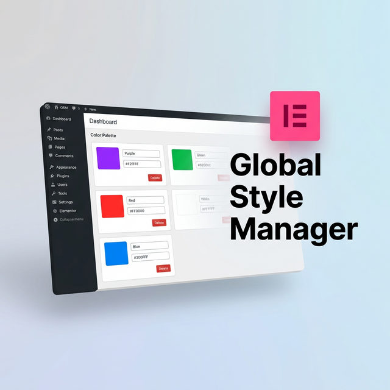

  <h1>🎨 GSM (Global Style Manager)</h1>

  
  

    
  

A robust, lightweight WordPress plugin designed to help you manage **Elementor Global Colors** and **Global Typography** outside of the heavy Elementor Editor. Built with a pristine, app-like UI natively in the WordPress Dashboard, GSM makes applying design systems to Elementor ultra-fast.

## ✨ Why Global Style Manager?

If you build WordPress sites using Elementor, you know how slow it can be to load the entire Elementor editor just to change a single primary color hex code or adjust a global font size. **Global Style Manager (GSM)** solves this by giving developers and designers a standalone, blazingly fast React-like interface within the WP Admin.

| The Elementor Problem | The GSM Solution |
|---|---|
| Editor takes too long to load just to tweak a hex code. | A lightweight, instant dashboard within your WordPress admin. |
| Clicking through multiple panels in Site Settings. | A consolidated dashboard featuring global colors and fonts on a single screen. |
| Inability to manage System styles easily. | Complete breakdown and visualization of both Custom and System variables. |
| Hard to mass-edit values across a design system. | Features a Raw JSON Code Editor for advanced users and mass Find/Replace. |

---

## 📦 Installation
1. **Download** this `global-style-manager` folder.
2. **Zip** the folder so it becomes `global-style-manager.zip`.
3. Go to **WordPress Admin → Plugins → Add New → Upload Plugin**.
4. Upload the zip file and click **Activate**.
5. The **Style Manager** (GSM) menu will now appear in your admin sidebar.
6. A quick access shortcut (🎨) is also added to the top **Admin Bar**.

---

## 🚀 Key Features & How to Use

### 🎨 Global Colors
- Navigate to the **Style Manager → Colors** tab.
- Click "Add Color" to create a new variable.
- You can change the hue or **opacity (Alpha)**, input hex codes directly, and assign a unique CSS variable ID.
- Drag and drop the cards to re-arrange your palette.

### ✏️ Global Typography
- Navigate to **Style Manager → Typography**.
- Click the font card to reveal the **Accordion** containing deep settings for Desktop, Tablet, and Mobile.
- Configure Font Family (Google Fonts autocomplete), Weight, Size, Line Height, Letter Spacing, and exact units (`px`, `em`, `rem`, `vw`, etc).

### 💻 The Code Editor (JSON)
- Navigate to **Style Manager → Code Editor**.
- **What is it?** Elementor natively stores all your colors and fonts as a large JSON array in the database (under the Active Kit post meta). 
- **What does it do?** This tab exposes that exact raw JSON to you. You can copy the code to back it up, paste another site's JSON to clone their design system instantly, or perform a mass "Find & Replace" text operation. Click "Apply to UI" to see your code changes mapped to the visual tabs!

### 💅 CSS Variables Reference
- A read-only tab that translates your current Elementor Kit into native `:root` CSS variables.
- Copy snippets from here to use in your Custom CSS (`var(--e-global-color-primary)`). 

---

## 🛠️ Built For Performance (Architecture)

Built using modern WordPress Plugin architecture and vanilla ES6 frontend practices to ensure zero impact on your site's frontend speed:
- **`global-style-manager.php`**: The main bootstrapper.
- **`includes/class-gsm-core.php`**: Core logic for manipulating the Elementor Active Kit database entries.
- **`includes/class-gsm-admin.php`**: Admin menu registration and lightweight asset enqueueing.
- **`includes/class-gsm-ajax.php`**: Secure nonce-protected REST endpoints for frontend UI operations.
- **`assets/js/admin.js`**: Vanilla JS application logic rendering a virtual DOM pattern.
- **`assets/css/admin.css`**: Complete app-like layout using native CSS variables.

---

## ⚠️ Disclaimer & Important Notes

> **⚠️ DISCLAIMER**  
> Please use this plugin with caution as it hasn't been used or tested extensively yet in diverse environments. There is a concern it might conflict with other WordPress functions or third-party Elementor add-ons depending on your specific setup. Feel free to open an issue or report bugs on GitHub!  
> *Tested and verified up to: **Elementor version 3.35.5**.*

- Always click **Publish Changes** in the top right to push your modifications to the database.
- After saving, **refresh your Elementor editor** if it was open in another tab to see the live changes.
- This plugin requires the free **Elementor Free** plugin to be active. Elementor Pro is supported but **not required**.
- Elementor CSS cache is automatically cleared and regenerated when you publish changes via GSM.

---

## 🤝 Contributing
Issues and Pull Requests are welcome.

**Tags:** `wordpress`, `elementor`, `elementor-extension`, `design-system`, `global-colors`, `typography`, `css-variables`, `wordpress-plugin`
